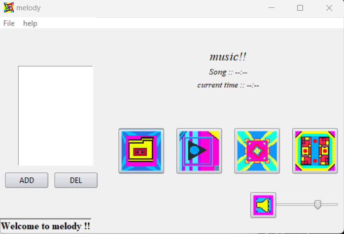

# Melody


A Music Player build in Python using ```tkinter ``` and ```pygame``` libraries.

## Pygame

Pygame is a Python library for making amazing GUI Games.

## Tkinter

Tkinter is a Python library used mainly for GUI works.

## Installation

Use the package manager [pip](https://pip.pypa.io/en/stable/) to install ```pygame```.

```bash

pip install pygame

```

The ```tkinter``` library is pre-installed in Python.

## Learning

It's made by the help of Tutorial that I watched in YouTube ([BuildWithPython](https://www.youtube.com/c/buildwithpython) - Really Cool Content)

